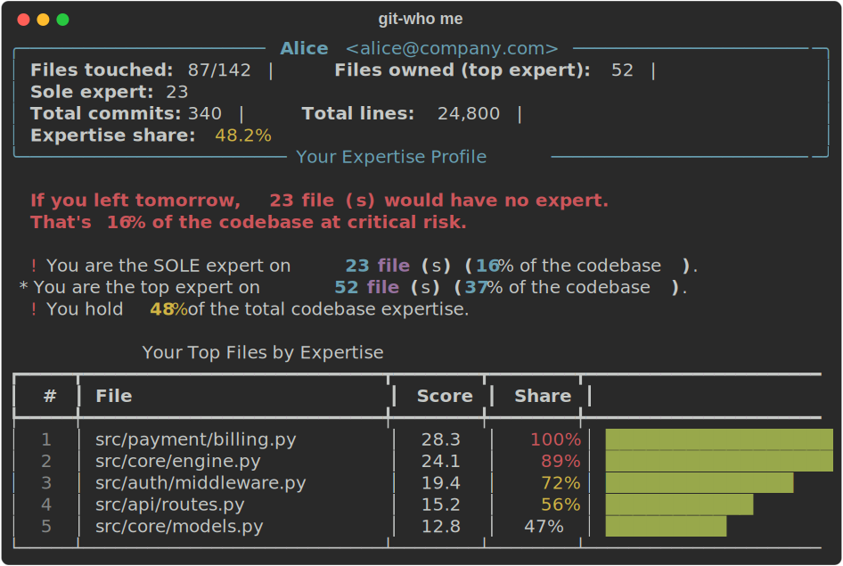
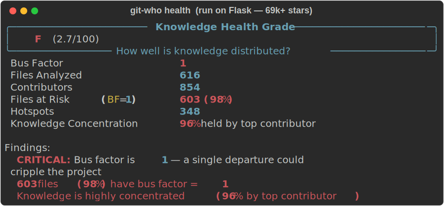

<p align="center">
  <h1 align="center">git-who</h1>
  <p align="center">
    <strong>Find out who really knows your code.</strong>
  </p>
  <p align="center">
    <a href="https://github.com/trinarymage/git-who/releases/latest"></a>
    <a href="https://github.com/trinarymage/git-who/actions"></a>
    <a href="https://github.com/trinarymage/git-who/blob/main/LICENSE"></a>
    
    <a href="https://github.com/trinarymage/git-who/stargazers"></a>
  </p>
</p>

---

**git-who** analyzes git history to compute expertise scores, bus factor, and code ownership. Unlike simple line-counting tools, git-who weights contributions by **recency**, **frequency**, and **volume** — showing who *actually* knows each part of your codebase right now.

<p align="center">
  <a href="https://trinarymage.github.io/git-who/"><strong>Live Demo</strong></a> &nbsp;|&nbsp;
  <a href="https://trinarymage.github.io/git-who/demo-flask-map.html"><strong>Interactive Treemap</strong></a> &nbsp;|&nbsp;
  <a href="https://trinarymage.github.io/git-who/demo-flask-report.html"><strong>Health Report</strong></a>
</p>

<p align="center">
  <picture>
    
  </picture>
</p>

## Why git-who?

Every codebase has hidden risks:

- **Who should review this PR?** — expertise-based reviewer suggestions, not random assignment
- **Which files will break if someone leaves?** — bus factor analysis per file, directory, and repo
- **Where are the risky hotspots?** — files changed often but known by only one person
- **Which team owns what?** — expertise grouped by email domain for org-level visibility
- **Who should own what?** — auto-generate CODEOWNERS from actual git expertise

git-who answers these in seconds. Zero config. Works on any git repository.

## Real-World Example: Flask

Here's what git-who finds when you run it on [Flask](https://github.com/pallets/flask) (69k+ stars):

<p align="center">
  <picture>
    
  </picture>
</p>

**37 contributors, but 88% of expertise held by one person.** That's the kind of insight `git-who` surfaces in seconds. Try it on your own repo — you might be surprised.

[See the full interactive treemap for Flask](https://trinarymage.github.io/git-who/demo-flask-map.html) | [Full health report](https://trinarymage.github.io/git-who/demo-flask-report.html)

## Installation

```bash
pip install git+https://github.com/trinarymage/git-who.git
```

Or clone and install locally:

```bash
git clone https://github.com/trinarymage/git-who.git
cd git-who && pip install -e .
```

## Quick Start

Run it in any git repository:

```bash
cd your-project
git-who health    # Get a letter grade for knowledge distribution
git-who           # Full overview with expertise scores
git-who hotspots  # Find your riskiest code
```

### Your Personal Expertise Profile

Run `git-who me` to see YOUR impact on the codebase — what you own, where you're the sole expert, and what happens if you leave:

```
$ git-who me

╭────────────────────── Alice  <alice@company.com> ──────────────────────╮
│   Files touched: 87/142   |   Files owned (top expert): 52   |        │
│   Sole expert: 23                                                      │
│   Total commits: 340   |   Total lines: 24,800   |                    │
│   Expertise share: 48.2%                                               │
╰──────────────────────── Your Expertise Profile ────────────────────────╯

  If you left tomorrow, 23 file(s) would have no expert.
  That's 16% of the codebase at critical risk.

  ! You are the SOLE expert on 23 file(s) (16% of the codebase).
    If you left, no one else has significant expertise on these.
  * You are the top expert on 52 file(s) (37% of the codebase).
  ! You hold 48% of the total codebase expertise.
    This is a significant concentration risk.

       Your Top Files by Expertise
┌───┬──────────────────────────┬───────┬───────┬────────────────────┐
│ # │ File                     │ Score │ Share │                    │
├───┼──────────────────────────┼───────┼───────┼────────────────────┤
│ 1 │ src/payment/billing.py   │  28.3 │  100% │ ████████████████████│
│ 2 │ src/core/engine.py       │  24.1 │   89% │ █████████████████   │
│ 3 │ src/auth/middleware.py   │  19.4 │   72% │ ██████████████      │
└───┴──────────────────────────┴───────┴───────┴────────────────────┘

       Files That Depend ONLY on You (23)
┌───┬──────────────────────────────────────────────┐
│ # │ File                                         │
├───┼──────────────────────────────────────────────┤
│ 1 │ src/payment/billing.py                       │
│ 2 │ src/payment/invoicing.py                     │
│ 3 │ src/auth/sso.py                              │
│ 4 │ src/core/scheduler.py                        │
└───┴──────────────────────────────────────────────┘
```

Try it on your repo — you might be surprised how much depends on you.

```bash
git-who me                     # Auto-detect from git config
git-who me "Alice"             # Show profile for a specific person
git-who --json me              # JSON for scripting
```

### All Commands

```bash
git-who                        # Full repository overview
git-who me                     # YOUR personal expertise profile (NEW)
git-who diff                   # Risk assessment for current changes (PR review)
git-who health                 # Letter grade for knowledge distribution
git-who hotspots               # High churn + low bus factor = risk
git-who bus-factor             # Detailed bus factor analysis
git-who churn                  # Most frequently changed files
git-who stale                  # Files with no recent activity
git-who trend                  # Bus factor trend over time
git-who codeowners             # Generate CODEOWNERS from expertise
git-who teams                  # Expertise by team (email domain)
git-who dirs                   # Expertise by directory
git-who file src/main.py       # Expertise for specific files
git-who review --base main     # Suggest reviewers for current changes
git-who onboarding             # New contributor guide
git-who map                    # Interactive ownership treemap
git-who report                 # Generate shareable HTML report
git-who badge -o badge.svg     # Generate SVG badge for your README
git-who --markdown             # Markdown report for PRs/docs
git-who --json                 # Machine-readable JSON output
```

### Filtering

```bash
git-who --since "6 months ago"          # Only recent history
git-who --since "2024-01-01"            # Since a specific date
git-who --ignore "vendor/*" --ignore "*.min.js"  # Exclude patterns
git-who --since "3 months ago" hotspots # Combine with any command
```

## Features

### Expertise Scoring

git-who computes a weighted score for each author on each file:

| Signal | What it measures | Why it matters |
|--------|-----------------|----------------|
| **Volume** | Lines added + deleted (log scale) | Raw contribution size, with diminishing returns |
| **Frequency** | Number of commits (log scale) | Many touches indicate deep familiarity |
| **Recency** | Time since last commit (180-day half-life) | Recent work = current knowledge |

**Score = volume x frequency x recency**

Someone who wrote 10,000 lines two years ago scores *lower* than someone who made 50 focused commits last month. Knowledge is about *current* familiarity, not historical credit.

### Bus Factor Analysis

The **bus factor** is the minimum number of people who would need to leave before a file (or the entire repo) loses more than 50% of its expertise.

```
$ git-who bus-factor

┌─────────────────────────────────────────────┐
│ Repository Bus Factor: 2                    │
└─────────────────────────────────────────────┘

       Files by Bus Factor
┌────────────┬───────┬──────────┬───────────┐
│ Bus Factor │ Files │ % of Repo│ Risk      │
├────────────┼───────┼──────────┼───────────┤
│     1      │    23 │      16% │ CRITICAL  │
│     2      │    54 │      38% │ WARNING   │
│     3+     │    65 │      46% │ OK        │
└────────────┴───────┴──────────┴───────────┘
```

### Hotspot Detection

A **hotspot** = frequently changed + low bus factor. Your riskiest code.

```
$ git-who hotspots

┌──────────────────────────────────────────────────────────────────┐
│ 3 hotspot(s) — files changed frequently but understood by few   │
│                  high churn + low bus factor = risk              │
└──────────────────────────────────────────────────────────────────┘
┌──────────────────────────┬─────────┬──────────────┬───────┬───────────────┐
│ File                     │ Commits │ Sole Expert  │ Score │ Churn         │
├──────────────────────────┼─────────┼──────────────┼───────┼───────────────┤
│ src/payment/billing.py   │      47 │ Alice        │  28.3 │ ███████████████│
│ src/auth/oauth.py        │      31 │ Bob          │  19.1 │ ██████████     │
│ src/api/middleware.py    │      22 │ Alice        │  15.4 │ ███████        │
└──────────────────────────┴─────────┴──────────────┴───────┴───────────────┘
```

### File Churn Rankings

See which files change most often — high churn files are where knowledge concentration matters most:

```
$ git-who churn

┌───────────────────────────────────────────────────────┐
│ 142 file(s) analyzed — showing the most actively changed files   │
└───────────────────────────────────────────────────────┘
┌───┬──────────────────────────┬─────────┬────────┬─────────┬───────────┐
│ # │ File                     │ Commits │ Lines  │ Authors │ Bus Factor│
├───┼──────────────────────────┼─────────┼────────┼─────────┼───────────┤
│ 1 │ src/payment/billing.py   │      47 │   2340 │       2 │     1     │
│ 2 │ src/api/middleware.py    │      31 │   1580 │       3 │     2     │
│ 3 │ src/auth/oauth.py        │      28 │   1120 │       1 │     1     │
└───┴──────────────────────────┴─────────┴────────┴─────────┴───────────┘
```

### Knowledge Health Grade

Get a letter grade for your repo's knowledge distribution — instantly shareable:

```
$ git-who health

╭─────────────────── Knowledge Health Grade ───────────────────╮
│   B+    (88.2/100)                                           │
╰──────────── How well is knowledge distributed? ──────────────╯
  Bus Factor                 3
  Files Analyzed             142
  Contributors               8
  Files at Risk (BF=1)       12 (8%)
  Hotspots                   3
  Stale Files                4
  Knowledge Concentration    38% held by top contributor

Findings:
  Good: Bus factor is 3
  12 files (8%) have bus factor = 1
  Knowledge is well distributed across the team
```

Use it in CI to track health over time:

```bash
GRADE=$(git-who --json health | jq -r '.grade')
echo "Knowledge health: $GRADE"
```

### Stale File Detection

Find files where expertise is going cold — no recent commits means decaying knowledge:

```
$ git-who stale --days 90

┌──────────────────────────────────────────────────┐
│ 12 stale file(s) — expertise is going cold               │
└──────────────────────────────────────────────────┘
┌───┬──────────────────────┬────────────┬──────────────┬───────┐
│ # │ File                 │ Days Stale │ Last Expert  │ Bus F │
├───┼──────────────────────┼────────────┼──────────────┼───────┤
│ 1 │ src/legacy/parser.py │        342 │ Alice        │   1   │
│ 2 │ src/old/utils.py     │        287 │ Bob          │   1   │
│ 3 │ docs/api.md          │        201 │ Charlie      │   2   │
└───┴──────────────────────┴────────────┴──────────────┴───────┘
```

### Team Analysis

Group expertise by email domain for org-level visibility:

```
$ git-who teams

┌───┬──────────────────────┬─────────┬───────┬─────────────┐
│ # │ Team (domain)        │ Members │ Files │ Total Score │
├───┼──────────────────────┼─────────┼───────┼─────────────┤
│ 1 │ company.com          │       5 │   120 │      482.3  │
│ 2 │ contractor.io        │       2 │    34 │       87.1  │
│ 3 │ gmail.com            │       1 │    12 │       23.4  │
└───┴──────────────────────┴─────────┴───────┴─────────────┘
```

### Reviewer Suggestions

```
$ git-who review --base main --exclude "Alice"

┌──────────────────────────────────┐
│ 5 changed files                  │
│        Suggested Reviewers       │
└──────────────────────────────────┘
┌───┬──────────────┬───────────┬──────────────────────┐
│ # │ Reviewer     │ Relevance │                      │
├───┼──────────────┼───────────┼──────────────────────┤
│ 1 │ Bob          │      24.3 │ ████████████████████ │
│ 2 │ Charlie      │      12.1 │ ██████████           │
│ 3 │ Diana        │       5.4 │ ████                 │
└───┴──────────────┴───────────┴──────────────────────┘
```

### Change Risk Assessment (NEW)

Run `git-who diff` before merging a PR to see how risky the changes are:

```
$ git-who diff --base main

╭──────────────── Change Risk Score ────────────────╮
│   B    (28.5/100)                                 │
╰─────────────────── vs main ───────────────────────╯
  Files changed: 4  |  +87 -12  |  New files: 1  |  At risk: 1

  ⚠️  1 file(s) with bus factor ≤ 1 being modified
  ℹ️  1 new file(s) added

              Changed Files
┌──────┬──────────────────────┬─────────┬────────────┬──────────┐
│ Risk │ File                 │ +/-     │ Bus Factor │ Expert   │
├──────┼──────────────────────┼─────────┼────────────┼──────────┤
│ HIGH │ src/auth/oauth.py    │ +42 -8  │     1      │ Bob      │
│ MED  │ src/api/routes.py    │ +20 -4  │     2      │ Alice    │
│ LOW  │ src/utils.py         │ +15 -0  │     3      │ Charlie  │
│ LOW  │ tests/test_auth.py   │ +10 -0  │     new    │ —        │
└──────┴──────────────────────┴─────────┴────────────┴──────────┘

Suggested Reviewers:
  1. Bob          ███████████████  (24.3)
  2. Alice        ██████████       (12.1)
```

Works great in CI pipelines — use `--json` for machine-readable output, `--markdown` for PR comments:

```bash
git-who --json diff --base main        # JSON for CI gates
git-who --markdown diff --base main    # Markdown for PR comments
```

### Directory Expertise

```
$ git-who dirs --depth 2

                Directory Expertise
┌──────────────┬───────┬────────────┬──────────────┬──────────┐
│ Directory    │ Files │ Bus Factor │ Top Expert   │ Hotspots │
├──────────────┼───────┼────────────┼──────────────┼──────────┤
│ src/api      │    32 │     3      │ Alice        │    1     │
│ src/auth     │    18 │     1      │ Bob          │    1     │
│ src/payment  │    15 │     2      │ Alice        │    1     │
│ tests        │    42 │     2      │ Bob          │    0     │
└──────────────┴───────┴────────────┴──────────────┴──────────┘
```

### CODEOWNERS Generation

Automatically generate a GitHub CODEOWNERS file based on actual expertise — no more guesswork:

```
$ git-who codeowners

# This file was auto-generated by git-who
# https://github.com/trinarymage/git-who
#
# To regenerate: git-who codeowners > .github/CODEOWNERS

*           Alice Bob Charlie
/src/api/   Alice Bob
/src/auth/  Bob
/src/core/  Charlie Alice
/tests/     Bob Alice
```

Write it directly to your repo:

```bash
git-who codeowners > .github/CODEOWNERS
```

Fine-tune the output:

```bash
# Per-file rules instead of per-directory
git-who codeowners --granularity file

# Deeper directory grouping
git-who codeowners --depth 2

# Use email addresses
git-who codeowners --emails

# Limit owners per entry
git-who codeowners --max-owners 2

# Only include authors above a score threshold
git-who codeowners --min-score 5.0

# No header comment
git-who codeowners --no-header

# JSON output for scripting
git-who --json codeowners | jq '.entries[] | select(.owners | length == 1)'
```

Keep CODEOWNERS in sync by running it in CI:

```yaml
- name: Update CODEOWNERS
  run: |
    pip install git+https://github.com/trinarymage/git-who.git
    git-who codeowners > .github/CODEOWNERS
    git diff --exit-code .github/CODEOWNERS || echo "::warning::CODEOWNERS is out of date"
```

### Trend Analysis

Track how your bus factor and knowledge distribution change over time:

```
$ git-who trend

╭──────────── Trend Analysis ─────────────╮
│ Bus Factor Trend: 1 → 3  (+2 improving) │
╰─────────────────────────────────────────╯
┌────────────┬────────────┬───────┬─────────┬─────────┬──────────────┐
│ Date       │ Bus Factor │ Files │ At Risk │ Authors │              │
├────────────┼────────────┼───────┼─────────┼─────────┼──────────────┤
│ 2024-01-15 │     1      │    28 │      28 │       1 │ ███          │
│ 2024-03-15 │     1      │    42 │      38 │       2 │ ███          │
│ 2024-05-15 │     2      │    67 │      31 │       3 │ ███████      │
│ 2024-07-15 │     2      │    89 │      27 │       4 │ ███████      │
│ 2024-09-15 │     3      │   112 │      18 │       5 │ ██████████   │
│ 2024-11-15 │     3      │   142 │      12 │       8 │ ██████████   │
└────────────┴────────────┴───────┴─────────┴─────────┴──────────────┘

  Sparkline: ▁▁▄▄██  (2024-01-15 → 2024-11-15)
```

### HTML Report

> **Live demo:** [Flask health report](https://trinarymage.github.io/git-who/demo-flask-report.html)

Generate a self-contained HTML report to share with your team:

```bash
git-who report                        # Write git-who-report.html
git-who report -o team-health.html    # Custom output path
```

The report includes health grade, contributor overview, hotspot analysis, and bus factor distribution — all in a single file with dark theme styling. No server required. Drop it in a PR, email it, or host it anywhere.

### Interactive Ownership Treemap

> **Live demo:** [Flask ownership treemap](https://trinarymage.github.io/git-who/demo-flask-map.html) | [Flask health report](https://trinarymage.github.io/git-who/demo-flask-report.html)

Visualize your entire codebase as a zoomable treemap — size = volume, color = risk:

```bash
git-who map                          # Write git-who-map.html
git-who map -o ownership.html        # Custom output path
```

The treemap is fully self-contained (no external dependencies) and interactive:

- **Size** represents total lines changed — bigger boxes mean more activity
- **Color** represents bus factor risk — red (BF=1), yellow (BF=2), green (BF=3+)
- **Click** any directory to zoom in; use breadcrumbs to navigate back
- **Hover** for details: expert, score, bus factor, number of contributors

Share it with your team, drop it in a PR, or use it in a retro to spot at-risk areas visually. Works offline — no server required.

### New Contributor Onboarding

Help new team members ramp up efficiently — show them who to ask, where to start, and what to avoid:

```
$ git-who onboarding

╭────────────── New Contributor Onboarding Guide ──────────────╮
│   8 file(s) with good knowledge distribution — safe to start │
│   12 high-churn sole-expert file(s) — tread carefully        │
│   Top mentor: Alice (52 files owned)                         │
╰────────── Who to talk to, where to start, what to avoid ─────╯

  Mentors — Who to ask for help
┌───┬──────────────┬─────────────┬───────────┐
│ # │ Author       │ Files Owned │ Avg Score │
├───┼──────────────┼─────────────┼───────────┤
│ 1 │ Alice        │          52 │      18.3 │
│ 2 │ Bob          │          38 │      14.7 │
│ 3 │ Charlie      │          31 │      11.2 │
└───┴──────────────┴─────────────┴───────────┘

  Safe to Start — Well-shared knowledge
┌──────────────────────────┬────┬──────────────┬──────────┐
│ File                     │ BF │ Contributors │ Ask      │
├──────────────────────────┼────┼──────────────┼──────────┤
│ src/utils.py             │  3 │            4 │ Alice    │
│ tests/test_core.py       │  3 │            3 │ Bob      │
│ docs/api.md              │  2 │            3 │ Charlie  │
└──────────────────────────┴────┴──────────────┴──────────┘

  Tread Carefully — Sole expert territory
┌──────────────────────────┬─────────┬──────────────┬───────┐
│ File                     │ Commits │ Sole Expert  │ Score │
├──────────────────────────┼─────────┼──────────────┼───────┤
│ src/payment/billing.py   │      47 │ Alice        │  28.3 │
│ src/auth/oauth.py        │      31 │ Bob          │  19.1 │
└──────────────────────────┴─────────┴──────────────┴───────┘
```

Share with new hires, include in your onboarding docs, or use `--json` for integration with your onboarding tools.

### Badge Generator

Generate shields.io-style SVG badges to embed in your README:

```bash
# Bus factor badge
git-who badge -o bus-factor.svg

# Health grade badge
git-who badge --type health -o health.svg
```

Then add to your README:

```markdown


```

### Output Formats

```bash
# JSON for scripting
git-who --json | jq '.bus_factor'
git-who hotspots --json | jq '.hotspots[] | .file'
git-who teams --json | jq '.teams[] | select(.member_count == 1)'

# Markdown for sharing
git-who --markdown > report.md
```

## GitHub Action

Use git-who in your CI/CD pipeline with the official GitHub Action:

```yaml
# .github/workflows/expertise.yml
name: Code Expertise Report
on: [pull_request]

jobs:
  expertise:
    runs-on: ubuntu-latest
    steps:
      - uses: actions/checkout@v4
        with:
          fetch-depth: 0  # Full history needed for analysis

      - uses: trinarymage/git-who@main
        with:
          command: overview
          format: markdown
          post-comment: true
          github-token: ${{ secrets.GITHUB_TOKEN }}
```

### Action Inputs

| Input | Description | Default |
|-------|-------------|---------|
| `command` | `overview`, `bus-factor`, `hotspots`, `dirs`, `review` | `overview` |
| `format` | `terminal`, `json`, `markdown` | `markdown` |
| `since` | Date filter (e.g., `"6 months ago"`) | |
| `ignore` | Comma-separated glob patterns | |
| `post-comment` | Post results as PR comment | `false` |
| `github-token` | Token for PR comments | |
| `fail-on-bus-factor` | Fail if bus factor below threshold | `0` |
| `min-commits` | Min commits for hotspot detection | `3` |
| `base` | Base branch for reviewer suggestions | `main` |

### Action Outputs

| Output | Description |
|--------|-------------|
| `bus-factor` | Repository-wide bus factor |
| `hotspot-count` | Number of hotspots detected |
| `report` | Full report text |

### Action Examples

**Bus factor gate** — fail the PR if bus factor drops:

```yaml
- uses: trinarymage/git-who@main
  with:
    fail-on-bus-factor: 2
```

**Auto-suggest reviewers:**

```yaml
- uses: trinarymage/git-who@main
  id: gitwho
  with:
    command: review
    format: json
    base: ${{ github.event.pull_request.base.ref }}
```

**Hotspot warnings:**

```yaml
- uses: trinarymage/git-who@main
  id: gitwho
  with:
    command: hotspots
    format: markdown
    post-comment: true
    github-token: ${{ secrets.GITHUB_TOKEN }}
```

## CI Integration (without the Action)

If you prefer scripting directly:

```yaml
- name: Change risk assessment on PR
  run: |
    pip install git+https://github.com/trinarymage/git-who.git
    RISK=$(git-who --json diff --base origin/main | jq '.risk_grade')
    echo "Change risk: $RISK"
    git-who --markdown diff --base origin/main > /tmp/risk-report.md
    gh pr comment ${{ github.event.pull_request.number }} --body-file /tmp/risk-report.md

- name: Check bus factor
  run: |
    pip install git+https://github.com/trinarymage/git-who.git
    BUS_FACTOR=$(git-who --json | jq '.bus_factor')
    if [ "$BUS_FACTOR" -lt 2 ]; then
      echo "::warning::Repository bus factor is $BUS_FACTOR"
    fi

- name: Post expertise report as PR comment
  run: |
    pip install git+https://github.com/trinarymage/git-who.git
    git-who --markdown > /tmp/report.md
    gh pr comment ${{ github.event.pull_request.number }} --body-file /tmp/report.md
```

## Comparison with Alternatives

| Feature | git-who | git-fame | git-extras |
|---------|---------|----------|------------|
| **Personal expertise profile** | **Yes (`git-who me`)** | No | No |
| **Change risk assessment** | **Yes (risk grade A-F per PR)** | No | No |
| Knowledge health grade | Yes (A+ to F, shareable) | No | No |
| Expertise scoring | Weighted (recency + frequency + volume) | Line count only | N/A |
| Bus factor | Per-file, per-directory, and repo-wide | No | No |
| Hotspot detection | Yes (churn x bus factor) | No | No |
| Trend analysis | Yes (bus factor over time) | No | No |
| File churn rankings | Yes | No | No |
| Stale file detection | Yes (configurable threshold) | No | No |
| CODEOWNERS generation | Yes (from expertise data) | No | No |
| Team analysis | Yes (by email domain) | No | No |
| Directory aggregation | Yes | No | No |
| Reviewer suggestions | Yes (expertise-based) | No | No |
| **Interactive treemap** | **Yes (zoomable, color-coded)** | No | No |
| HTML report | Yes (self-contained, shareable) | No | No |
| SVG badge generator | Yes (bus factor + health) | No | No |
| Recency weighting | Yes (180-day half-life) | No | No |
| Time filtering | Yes (`--since`) | No | No |
| File exclusion | Yes (`--ignore`) | No | No |
| Markdown output | Yes | No | No |
| JSON output | Yes | Yes | No |
| GitHub Action | Yes (official) | No | No |
| Zero config | Yes | Yes | Yes |

## Pre-commit Hook

Use git-who as a [pre-commit](https://pre-commit.com/) hook to monitor bus factor in CI:

```yaml
# .pre-commit-config.yaml
repos:
  - repo: https://github.com/trinarymage/git-who
    rev: v0.12.0  # or pin to latest release
    hooks:
      - id: git-who-bus-factor
```

## Development

```bash
git clone https://github.com/trinarymage/git-who.git
cd git-who
pip install -e ".[dev]"
pytest
```

## License

MIT
